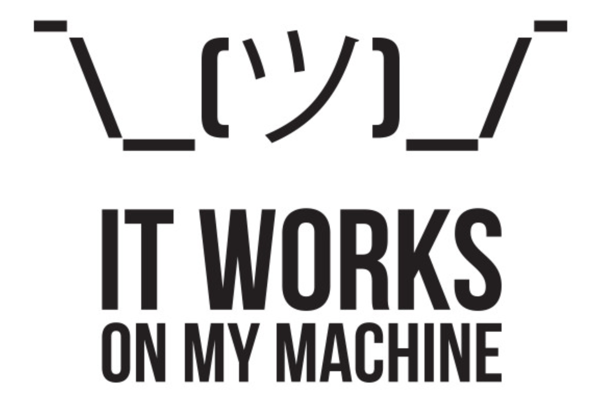

layout: true

.signature[@algogrit]

---

class: center, middle

# 12 Factor Apps

by engineers much, much smarter than me

.content-credits[https://12factor.net/]

---

# Agenda

- Understanding principles underlying several scalable web/api application
- Identifying the principles we already apply
- *...and some that we don't*

---

## I. Single Codebase Per App

.center[

]

.image-credits[https://12factor.net/codebase]

---
class: center, middle

*If there are multiple codebases, it’s not an app – it’s a distributed system.*

.content-credits[https://12factor.net/codebase]

---

## II. Explicitly declare & isolate dependencies

.center[
*maven, npm, bundle, pip, go mod, ...*
]

---
class: center, middle

What about system dependencies?

---

## III. Store config in the environment

- *App config which differs per environment like Hostname*
- *Credentials to any external services like AWS, GCP*
- *Config which can change across deploys like issues on db instance*

---

## IV. Treat backing services as attached resources

.center[

]

.image-credits[https://12factor.net/backing-services]

---
class: center, middle

*In ~~theory~~ dev, everything runs in the same machine...*

*...In ~~practice~~ prod, it depends!*

---
class: center, middle

**The code for a twelve-factor app makes no distinction between local and third party services.**

.content-credits[https://12factor.net/backing-services]

---

## V. Strictly separate build and run stages

.center[

]

.image-credits[https://12factor.net/build-release-run]

---
class: center, middle

**The twelve-factor app uses strict separation between the build, release, and run stages.**

.content-credits[https://12factor.net/build-release-run]

---

## VI. Execute the app as one or more stateless processes

**Twelve-factor processes are stateless and share-nothing.** Any data that needs to persist must be stored in a stateful backing service, typically a database.

.content-credits[https://12factor.net/processes]

---

## VII. Export services via port binding

- Ties back to: *III. Store config in the environment*
- Ties back to: *IV. Treat backing services as attached resources*

---
class: center, middle

**The twelve-factor app is completely self-contained and does not rely on runtime injection of a webserver into the execution environment to create a web-facing service.**

*The web app exports HTTP as a service by binding to a port, and listening to requests coming in on that port.*

.content-credits[https://12factor.net/processes]

---

## VIII. Scale out via the process model - Concurrency

.center[

]

.image-credits[https://12factor.net/concurrency]

---
class: center, middle

**In the twelve-factor app, processes are a first class citizen.**

.content-credits[https://12factor.net/concurrency]

---

## IX. Maximize robustness with fast startup and graceful shutdown

---
class: center, middle

**The twelve-factor app’s processes are disposable, meaning they can be started or stopped at a moment’s notice.**

*This facilitates fast elastic scaling, rapid deployment of code or config changes, and robustness of production deploys.*

.content-credits[https://12factor.net/disposability]

---

## X. Keep development, staging, and production as similar as possible

.center[

]

.image-credits[https://medium.com/@rquartel/definition-of-dumb-and-it-works-on-my-machine-1eca396ee70]

---
class: center, middle

**The twelve-factor app is designed for continuous deployment by keeping the gap between development and production small.**

.content-credits[https://12factor.net/dev-prod-parity]

---

### Goal: Minimize gaps

- Make the **time** gap small: a developer may write code and have it deployed hours or even just minutes later.
- Make the **personnel** gap small: developers who wrote code are closely involved in deploying it and watching its behavior in production.
- Make the **tools** gap small: keep development and production as similar as possible.

.content-credits[https://12factor.net/dev-prod-parity]

---

## XI. Treat logs as event streams

---
class: center, middle

**A twelve-factor app never concerns itself with routing or storage of its output stream.**

.content-credits[https://12factor.net/logs]

---

## XII. Run admin/management tasks as one-off processes

---
class: center, middle

*The process formation is the array of processes that are used to do the app’s regular business (such as handling web requests) as it runs.*

*Separately, developers will often wish to do one-off administrative or maintenance tasks for the app.*

.content-credits[https://12factor.net/admin-processes]

---
class: center, middle

Code
https://github.com/algogrit/presentation-12-factor-apps

Slides
https://12-factor-apps.slides.algogrit.com
